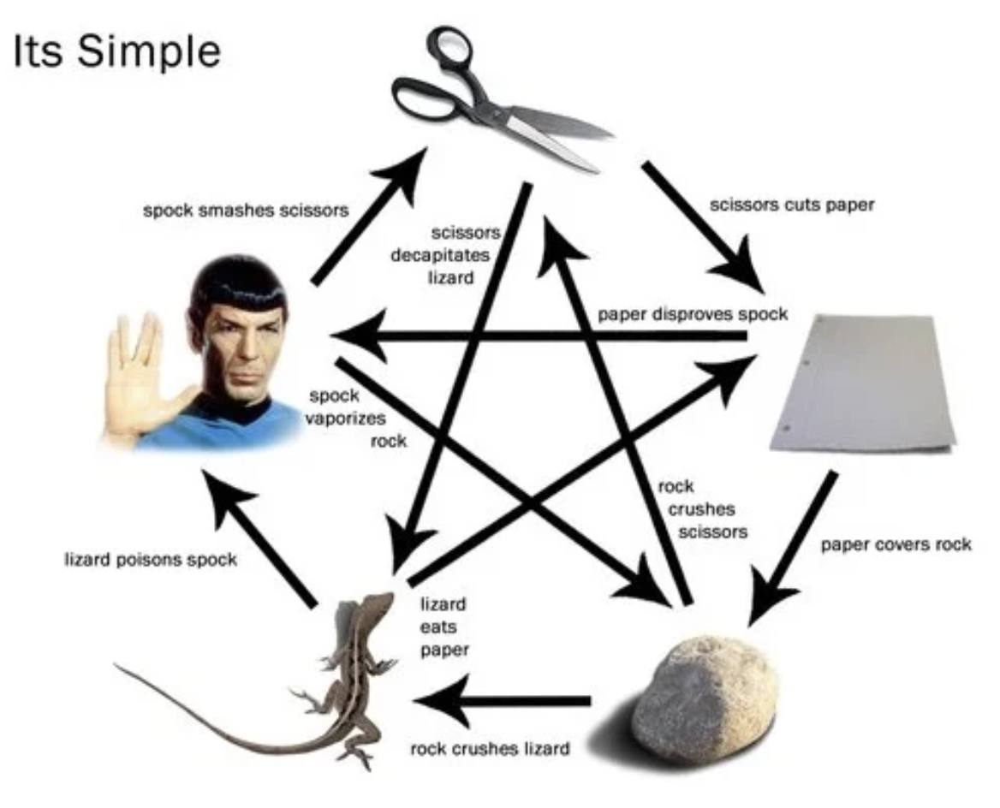

# Rock, Paper, Scissors, Lizard, Spock  
## Gameplay
This is a simple game where you play against the computer by selecting 1 of 5 options to try to beat the CPU.  
This game is like the popular game "Rock, Paper, Scissors" but with the added options of Lizard and Spock.  
## Rules
  
The player picks an option and the computer picks a random option.  
The winner is decided using the image above.
## Features
- The win messages are selected using a hashmap
- GUI threading to prevent lag and future bugs

## Logic
It builds the buttons than waits for the player to make a choice, each button runs the game() method with the corresponding player choice parameter.
``` java
// def of Buttons
JButton rock = new JButton("\uD83E\uDEA8 Rock \uD83E\uDEA8");
JButton paper = new JButton("\uD83D\uDCC4 Paper \uD83D\uDCC4");
JButton scissor = new JButton("✂️ Scissor ✂️");
JButton lizard = new JButton("\uD83E\uDD8E Lizard \uD83E\uDD8E");
JButton spock = new JButton("\uD83D\uDD96 Spock \uD83D\uDD96");

//buttons do stuff if clicked 
rock.addActionListener(_ -> game("rock"));
paper.addActionListener(_ -> game("paper"));
scissor.addActionListener(_ -> game("scissor"));
lizard.addActionListener(_ -> game("lizard"));
spock.addActionListener(_ -> game("spock"));

//buttons
buttonPanel.add(rock);
buttonPanel.add(paper);
buttonPanel.add(scissor);
buttonPanel.add(lizard);
buttonPanel.add(spock);
```

The game() method declares lists of all possible options contained with every option they win against. 
``` java
List<String> rock = new ArrayList<>();
rock.add("scissor");
rock.add("lizard");

List<String> paper = new ArrayList<>();
paper.add("spock");
paper.add("rock");

List<String> scissor = new ArrayList<>();
scissor.add("paper");
scissor.add("lizard");

List<String> lizard = new ArrayList<>();
lizard.add("spock");
lizard.add("paper");

List<String> spock = new ArrayList<>();
spock.add("rock");
spock.add("scissor");
```
Picks a random number using the var random and picks a random item of the choices list.  
        
``` java
private static final String[] choices = {"rock", "paper", "scissor", "lizard", "spock"};
private static final Random random = new Random();
```
``` java
String computerChoice = choices[random.nextInt(choices.length)];
```

The game() method gets the result Win / Tie / Lose
``` java
String result; //declare result
if (playerChoice.equals(computerChoice)) {
    result = "Tie";
} else {
    boolean winOrLose = switch (playerChoice) { //match case
        case "rock" -> rock.contains(computerChoice);
        case "paper" -> paper.contains(computerChoice);
        case "scissor" -> scissor.contains(computerChoice);
        case "lizard" -> lizard.contains(computerChoice);
        case "spock" -> spock.contains(computerChoice);
        default -> false;
    };
    if (winOrLose) {
        result = "Player Wins";
        playerScore++;
    } else {
        result = "Computer Wins";
        computerScore++;
    }
}
```
Then the method uses GUI threading and builds a lambda expression that updates the GUI.
``` java
SwingUtilities.invokeLater(() -> {...};
```
In the lambda expression the first thing it does is make a hashmap.
``` java
HashMap<String, String> winMessages = new HashMap<>();

//rock wins
winMessages.put("rock-scissor", "🪨 Rock crushes ✂️ scissors");
winMessages.put("rock-lizard", "🪨 Rock crushes 🦎 lizard");
//rock losses
winMessages.put("rock-paper", "📄 Paper covers 🪨 rock");
winMessages.put("rock-spock", "🖖 Spock vaporizes 🪨 rock");
//rock tie
winMessages.put("rock-rock", "🪨 Rock crashes into 🪨 rock, both shatter equally");

//paper wins
winMessages.put("paper-rock", "📄 Paper covers 🪨 rock");
winMessages.put("paper-spock", "📄 Paper disproves 🖖 Spock");
//paper losses
winMessages.put("paper-scissor", "✂️ Scissors cuts 📄 paper");
winMessages.put("paper-lizard", "🦎 Lizard eats 📄 paper");
//paper tie
winMessages.put("paper-paper", "📄 Paper recognizes 📄 paper and tie");

//scissor wins
winMessages.put("scissor-paper", "✂️ Scissors cuts 📄 paper");
winMessages.put("scissor-lizard", "✂️ Scissors decapitates 🦎 lizard");
//scissor losses
winMessages.put("scissor-spock", "🖖 Spock smashes ✂️ scissors");
winMessages.put("scissor-rock", "🪨 Rock crushes ✂️ scissors");
//scissor tie
winMessages.put("scissor-scissor", "✂️ Scissors attempt to fight but can not cut metal");
 
//lizard wins
winMessages.put("lizard-spock", "🦎 Lizard poisons 🖖 Spock");
winMessages.put("lizard-paper", "🦎 Lizard eats 📄 paper");
//lizard losses
winMessages.put("lizard-scissor", "✂️ Scissors decapitates 🦎 lizard");
winMessages.put("lizard-rock", "🪨 Rock crushes 🦎 lizard");
//lizard tie
winMessages.put("lizard-lizard", "🦎 Lizard befriends 🦎 lizard");

//spock wins
winMessages.put("spock-scissor", "🖖 Spock smashes ✂️ scissors");
winMessages.put("spock-rock", "🖖 Spock vaporizes 🪨 rock");
//spock losses
winMessages.put("spock-lizard", "🦎 Lizard poisons 🖖 Spock");
winMessages.put("spock-paper", "📄 Paper disproves 🖖 Spock");
//spock tie
winMessages.put("spock-spock", "🖖 Spock loves 🖖 Spock and refuses to fight");
```
Then the lambda expression updates the "botPickLabel" using the animation method to display the correct winner and with the hashmap.
``` java
if (result.equals("Player Wins")) {
    String key = playerChoice + "-" + computerChoice; //makes the key
    String message = winMessages.get(key); //finds the right win message using the key
    botPickLabel.setText(message + " | " + result); //update the botPickLabel to show the results
}
if (result.equals("Computer Wins") || result.equals("Tie")) {
    String key = computerChoice + "-" + playerChoice;
    String message = winMessages.get(key);
    botPickLabel.setText(message + " | " + result);
}
```
The animation method.
``` java
public static void animation(String message,  Runnable onComplete){
    String[] animationSteps = {"Rock", "Paper", "Scissors", "Lizard", "Spock"};

    Timer timer = new Timer(1000, null); //need to use timer because sleep() freezes the whole window so it only shows the last thing, this fires every second
    final int[] index = {0}; //array cuz lambdas need something about "effectively final" vars, this keeps track of what step it is on

    timer.addActionListener(e -> { //lambda expression --- this tell the timer what to run everytime it goes off
        if (index[0] < animationSteps.length) { //is it done?
            botPickLabel.setText(animationSteps[index[0]]);
            index[0]++;
        } else {
            botPickLabel.setText(message);
            timer.stop(); // stop the timer
            if (onComplete != null) {
                onComplete.run(); //run the code after animation finishes
            }
        }
        System.out.println(e);
    });

    timer.start();

}
```
The first thing it does is declare the animationSteps, Timer, and index vars.
``` java
String[] animationSteps = {"Rock", "Paper", "Scissors", "Lizard", "Spock"};

Timer timer = new Timer(1000, null); //need to use timer because sleep() freezes the whole window so it only shows the last thing
final int[] index = {0}; //array cuz lambdas need something about "effectively final" vars
```
Then it tells the timer what to do.
``` java
timer.addActionListener(e -> { //lambda expression --- this tell the timer what to run everytime it goes off
        if (index[0] < animationSteps.length) { //is it done?
            botPickLabel.setText(animationSteps[index[0]]);
            index[0]++;
        } else {
            botPickLabel.setText(message);
            timer.stop(); // stop the timer
            if (onComplete != null) {
                onComplete.run(); //run the code after animation finishes
            }
        }
        System.out.println(e); 
    });
```
Than it starts the timer.
``` java
timer.start();
```
## Extra info Q / A
Q: What is a timer?   
A: A timer is will run a section of code after a set amount of time, it loops this while the timer is on.  

Q: What is callback?  
A: It's a parameter in the animation method that runs whatever code is in it after the method runs.  

Q: Effectively Final mean?  
A: In lambdas, java has a rule where the outside vars used can not be changed.  

Q: Why use a Timer instead of sleep()?  
A: Sleep freezes the entire GUI, but Timer lets the animation run smoothly without freezing the window.
## Hardest part
The hardest part of this project was building the animations, I had to learn a lot about threading. 
